<div align="center">
  
</div>

<br>

<div align="center">

```
// TRANSMISSION: ACTIVE  |  CLEARANCE: ALPHA-7  |  SIDE: IMPERIAL
```

</div>

---

## 📡 Archivo de identidad

> *"I must not fear. Fear is the mind-killer. Fear is the little-death that brings total obliteration."*
> *— Paul Atreides · El código, como la especia, debe fluir.*

```yaml
CLASIFICACIÓN : Tecnólogo en Análisis y Desarrollo de Software
ESPECIALIZACIÓN: Backend · Frontend · Automatización SAP
STACK OPERATIVO: Python · MySQL · Node.js · Flutter
DIRECTIVA      : UI/UX · Soluciones de alto valor organizacional
MISIÓN         : Optimizar procesos · Construir interfaces que importen
SIDE           : Imperial ◈
```

---

## ⚡ Arsenal tecnológico

**Lenguajes**

[](https://skillicons.dev)

**Frontend**

[](https://skillicons.dev)

**Backend**

[](https://skillicons.dev)

**Bases de datos**

[](https://skillicons.dev)

**DevOps & Herramientas**

[](https://skillicons.dev)

**Metodologías**

```
◈ Metodologías ágiles   ◈ Scrum   ◈ Gestión de proyectos
```
---

## 🎬 Transmisiones de interés

<div align="center">
  
  &nbsp;
  
  &nbsp;
  
</div>

<div align="center">
  <sub>Star Wars &nbsp;·&nbsp; Dune &nbsp;·&nbsp; Coding</sub>
</div>

---

## 📊 Estadísticas de combate

<p align="center">
<a href="https://git.io/streak-stats"></a>
</p>

<p align="center">
  
  &nbsp;
  
</p>

---

## 🏛 Misión principal

```
┌──────────────────────────────────────────────────────┐
│  ▲  ARQVISIÓN 3D                                     │
│     Renderizado arquitectónico · Visualización 3D    │
│     Diseño realista · Marca en construcción          │
└──────────────────────────────────────────────────────┘
```

---

<div align="center">
  <sub>
    "Do. Or do not. There is no try." — Yoda
    &nbsp;·&nbsp;
    "The spice must flow." — Dune
  </sub>
</div>
